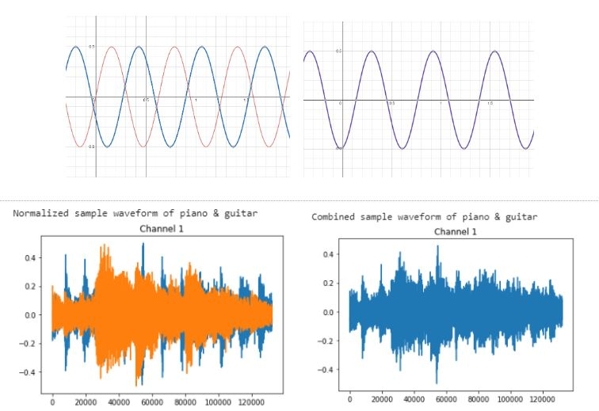

# Multi-Label Instrument Classification in Audio Recordings

The project was split into two stages. Stage 1 builds a single instrument classifier model to predict one instrument playing in a single-instrument audio file. Stage 2 uses transfer learning from Stage 1's 1D CNN model architecture to predict which two instruments are playing in a music sample. The [IRMAS dataset](https://www.upf.edu/web/mtg/irmas) was used to train the model. Additionally, the entirety of the project was implemented using the [PyTorch library](https://github.com/pytorch/pytorch) and accelerated using GPUs on Google Collab.


## Environment Preparation

* Install python 3.6 < 
* Install the following packages in addition to a system compatible Pytorch package:
    ```python 
    pip install torchaudio==0.6.0
    pip install torchvision==0.7.0
    pip install -U scikit-learn
    ```
 
## Project Structure

The project was divided into two key stages. This process is outlined below. 


Stage 1 involves building a classifier to determine the single instrument that is playing in an audio file. All samples in the single instrument dataset consist of only one instrument playing at a time. Stage 2 expands on the idea of Stage 1 and involves building a neural network model that can identify which instrument(s) is/are present in a multi-instrument sample. These multi-instrument samples are generated based on the single instrument dataset by overlapping those audio samples. Refer to the two images below for an illustration of the stages.


## Data Processing

### Raw Data
Four instrument classes were selected for classification: acoustic guitar, piano, trumpet and violin. The raw data for each .wav file is a tensor of size [2, 132299], with sample rate 44100 Hz. Here's a table showing the number of sample per instrument used for the training process:

| Class  | Number of samples |
| ------- | ------------- |
| Acoustic guitar | 637  |
| Piano | 721 |
| Trumpet | 577 |
| Violin | 580 |

### Data Balancing
Data balancing was done by adding augmented audio to the classes with fewer data. The augmented data was generated by reversing the signs of all audio data. An example of data augmentation is illustrated in the images below. The number of samples after data balancing is shown in the following table, this data is split into [0.6, 0.2, 0.2] for training, validation and testing. Total data count for each class is 721. The class labels are randomized to make sure they are evenly distributed across three datasets, so that each class can be evenly represented in the three datasets.


| Class  | Training Count | Validation Count | Testing Count |
| ------ | -------------- | ---------------- | ------------- | 
| Acoustic guitar | 433 | 144 | 144 | 
| Piano | 433 | 144 | 144 | 
| Trumpet | 433 | 144 | 144 | 
| Violin | 433 | 144 | 144 | 

### Data Normalization

The raw data are normalized in range [-0.5, 0.5] to unify audio magnitude. This can avoid loud instruments overshadowing others when generating multi-instrument audio. 

### Generating Multi-instrument Audios for Stage 2

Multi-instrument audio files are generated by summing the tensors of different instrument audios and normalizing it. These new data will be used to both train and test new models in Stage 2. An example of data augmentation is illustrated below:



## Architecture

In **Stage 1**, the model output is a four-dimensional vector representing the probability across the four instrument classes. The training labels are one-hot encoding vectors identifying the true class the sample belongs to. The cross entropy loss was used during training, which also accounts for the softmax activation at the output. 

In **Stage 2**, the model identifies the instruments present in data samples. The output of the model is a 4D multi-label classification vector, where each value represents the probability of the corresponding class being positive. The target vector is a similar “two-hot” encoding vector indicating two instruments in the sample (e.g. [1 0 0 1] represents the instrument at index 0 and 3 are present in the sample). In this stage, the multi-label soft margin loss is used to compute the loss of multi-label output. It accounts for the sigmoid activations at the output.

The training process for both stages is very similar. Coincidentally, it was found that the optimal hyperparameters and architecture for Stage 2 are the same as those of Stage 1. The best architecture used for this consists of six 1D convolutional layers and one fully connected layer. Elements including dropout layers, batch normalization, adding more convolutional layers, and reducing parameters in the linear layers are added as well. 

A visual representation of the best CNN architecture is shown below. The audio input consists of two channels with 132,299 frames. Max pooling layers are used to reduce dimensionality for the fully connected layer. Various kernel sizes are used to capture audio features of different frequencies. A stride of one and no padding is used throughout. 


In addition to training a CNN from scratch, a transfer learning model was also applied in Stage 2. Since no existing transfer learning model was found to distinguish instruments, audio features are extracted using the weights of the network found in Stage 1. After features were extracted from the CNN model from Stage 1, the ANN shown below was used for classification.


In terms of computation time and memory required, the transfer learning model has a clear edge, as shown in the table below. Transfer learning would allow us to train less than half the number of parameters. Both the computation time per epoch as well as overall computation time are significantly less with transfer learning. From these metrics, it is clear that there is a huge potential with this concept. This could be further explored as the focus of future projects.

|  | CNN | Transfer Learning |
| - | --- | ----------------- |
| # Learnable Parameters | 81166 | 30754 |
| Computation Time per Epoch | 93 | 0.33 |
| Overall Average Computation Time | ~30 min | 3.3 s |

## Result & Discussion

The models for both stages performed well and significantly outperformed the baseline, as outlined in the table below. From the Stage 2 results it is clear that the transfer learning validation accuracy is comparable with that of the initial CNN. However, the test accuracy on the holdout dataset differs by 5%. This reflects some limitations in the transfer learning model’s ability to generalize to new data. Since the model with the higher validation accuracy in Stage 2 is the 1D CNN, all further analysis in this section will pertain to the CNN model.

|  | Validation Accuracy | Test Accuracy |
| -- | ----------------- | ------------- |
| Stage 1: 1D CNN | 72.57% | 70.66% | 
| Stage 2: 1D CNN | 69.05% | 69.74% | 
| Stage 2: TL Model | 68.21% | 64.16% | 

### Stage 1 Results and Analysis
Analyzing the confusion matrix below for the first Stage, the trumpet class stands out to be the best, with the highest true positive rate (88.55%) along with lowest false positive (4.49%) rate. This makes sense because the trumpet is the only brass instrument. However, the guitar class, which has the second highest true positive rate (74.34%), also has the highest false positive rate (20.28%). Additionally, the piano and violin classes account for almost all of the guitar’s false positives and negatives. Considering the numerous styles of playing the guitar, piano, and violin, these results are reasonable. Also, these three instruments are stringed, creating inherent similarities between their audio data. This idea of similarity between these instruments is further evidenced by the piano’s false negatives, which are mostly misclassified as guitar samples. 

|  | Guitar | Piano | Trumpet | Violin |
| --- | --- | ----- | ------- | ------ |
| Guitar | **113** | **23** | **1** | **15** | 
|  Piano | **57** | **81** | **7** | **3** | 
| Trumpet | **4** | **8** | **116** | **3** | 
| Violin | **25** | **11** | **12** | **97** |

### Stage 2 Results and Analysis

With the second Stage, the test accuracy for individual binary classifications was 69.74%. However, looking at the confusion matrix below, there are some interesting results when it came to classifying all four binary labels for each sample. Apart from the fact that around half the multi-label predictions classified an incorrect number of instruments (as shown in the rightmost column), a pattern that segregates the multi-label classes into two parts -- a group for the samples containing the guitar and another for the samples without the guitar. Within each subgroup of multi-label classes, there are high false positive and negative rates. It appears that the network has trouble differentiating between instrument pairs within the same subgroup. Additionally, misclassifications outside of those subgroups are rare in comparison. This interesting observation suggests that it is much easier to detect the presence of the guitar than it is to detect the presence of the piano, violin, or trumpet, when in a mixed setting. Perhaps in the future, experimentation could be done with more instruments or other instrument combinations to see whether this pattern occurs with other instruments. 

|  | Guitar + Piano | Guitar + Trumpet | Guitar + Violin | Piano + Trumpet | Piano + Violin | Trumpet + Violin | Other |
| -------------- | ------- | ---- | ------- | ----- | ----- | ----- | ----- |
| Guitar + Piano | **21** | **35** | **32** | **2** | **1** | **1** | **65** |
| Guitar + Trumpet | **20** | **25** | **19** | **2** | **0** | **0** | **75** |
| Guitar + Violin | **11** | **13** | **70** | **0** | **3** | **1** | **44** |
| Piano + Trumpet | **4** | **2** | **1** | **53** | **13** | **5** | **60** |
| Piano + Violin | **1** | **4** | **11** | **25** | **13** | **15** | **70** |
| Trumpet + Violin | **7** | **3** | **18** | **11** | **18** | **10** | **81** |
| Other | **0** | **0** | **0** | **0** | **0** | **0** | **0** | 

## Ethical Considerations
In this project, good machine learning practices were maintained by proactively preventing model bias. It was ensured that the data used to train, validate, and test the model is balanced across classes. This is necessary during training to give the model equal opportunity to learn and generalize for classes. 

For the project, the model was trained on western instruments. However, training the model on only a set of certain instruments will only enable classification of those instruments. In particular, training on different genres of music would have an effect since different cultures would have different dominant instruments. During data processing, all data was normalized to be equal and then mixed them equally. However, in a live concert setting, this would not be the case. Therefore, if this model were to be further developed, it should be ensured that data collected is representative of a more diverse group of instruments and genres.

Additionally, an ethical issue could arise from a similar project that includes voice classification. Privacy concerns behind gathering people’s voices would exist. Different languages have varying tones that would also need to be represented within the data.

## Project Improvements

 + In Stage 2, BCEWithLogitsLoss() was initially used which was inconvenient when implementing multi-label classification. It would be better for future machine learning problems to search for implemented functions in library documentation such as Pytorch.
 + Since machine learning is dependent on many libraries which are updated frequently these days, it’s a good idea to keep track of library versions you are working with. For instance torchaudio library was updated mid-project which worked with a later version of pytorch. This caused major issues with GPU drivers. Hence, torchaudio was kept to its older version since Google Collab’s GPU drivers work with an older version of pytorch.
 + To further this project, explore a 3-instrument multi-label classification leading to N-instrument multi-label classification. Since it deals mostly with audio data which one-dimensional time series data… results from this project could be used in other projects with similar data. Other project ideas include music genre classification; voice recognition & language recognition.
